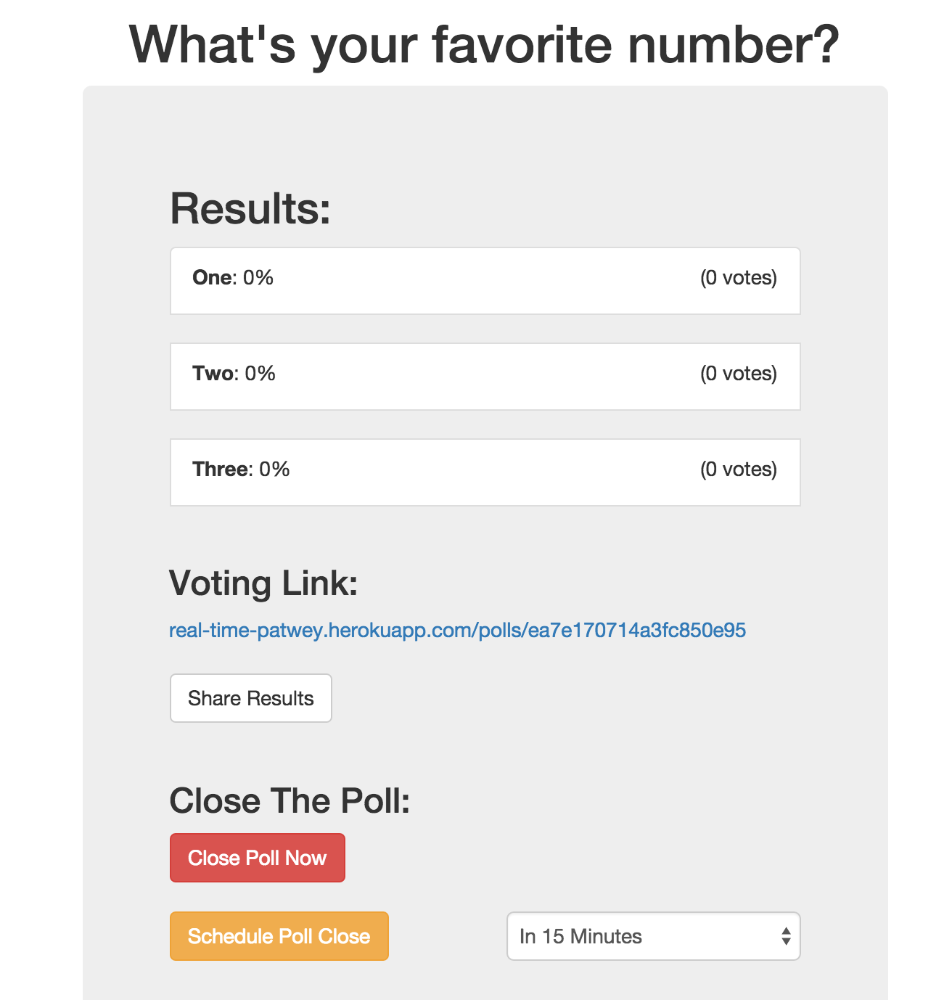
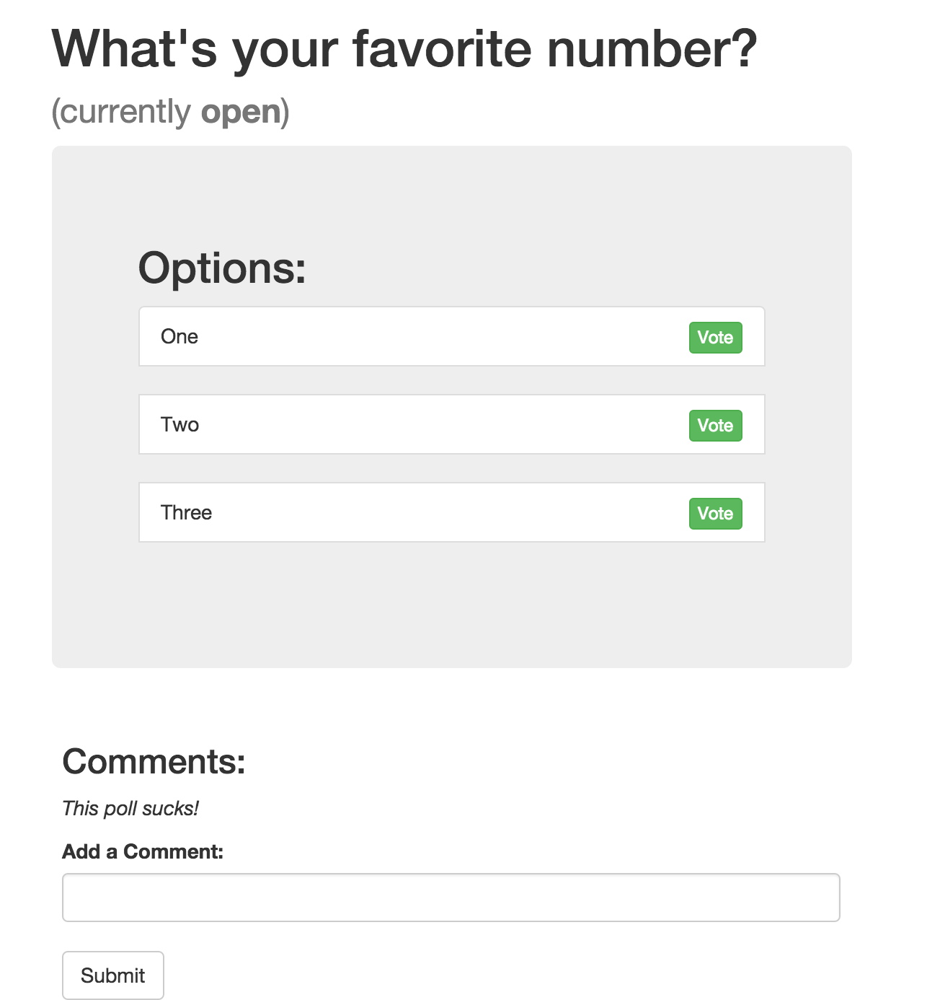
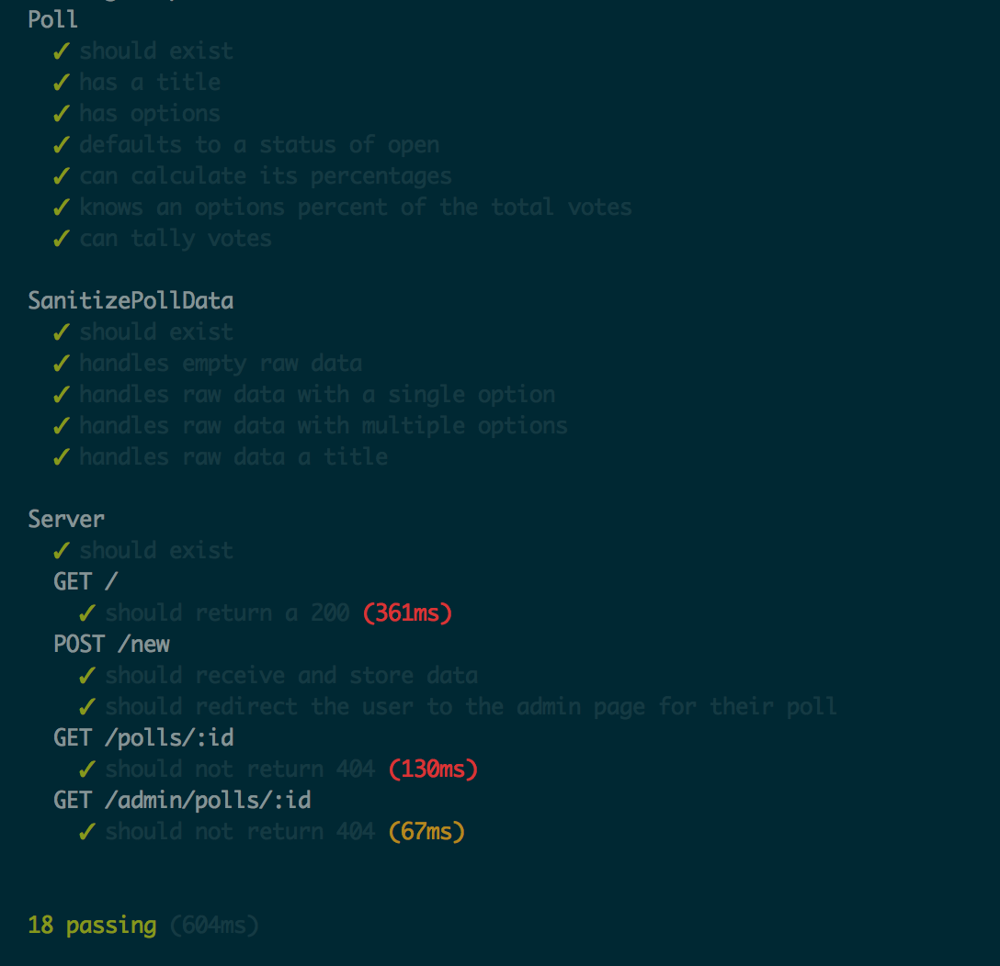

# Real-Time Submission Form
[Project Spec](https://github.com/turingschool/curriculum/blob/master/source/projects/real_time.markdown)

* Submit a pull request
* Pro Tip: You can use [recordit.co](http://recordit.co/) to record interaction gifs.
* Secondary Pro Tip: [Here's how to link to specific line number(s) in Github](http://stackoverflow.com/questions/23821235/how-to-link-to-specific-line-number-on-github)
* Tertiary Pro Tip: You can re-use some of these things in your portfolio/resume

------

# Basics

### Link to the Github Repository for the Project
[https://github.com/patwey/real_time](https://github.com/patwey/real_time)

### Link to the Deployed Application
[https://real-time-patwey.herokuapp.com/](https://real-time-patwey.herokuapp.com/)

### Link to Your Commits in the Github Repository for the Project
[https://github.com/patwey/real_time/commits/master](https://github.com/patwey/real_time/commits/master)

### Provide a Screenshot of your Application

## Completion

### Were you able to complete what you feel is the base functionality?

Yes.

#### If not, list what functionality you think may be missing missing.

N/A

### What features did you complete which you feel 'exceeded expectations'?

Voters can add and view comments on a poll.

### Attach a .gif, or images of any extensions work being used on the site.

# Code Quality

### Link to a specific block of your code on Github that you are proud of

[pride](https://github.com/patwey/real_time/blob/master/lib/poll.js#L3)

#### Why were you proud of this piece of code?

I was proud to abstract the poll functionality into an object.

### Link to a specific block of your code on Github that you feel not great about

[shame](https://github.com/patwey/real_time/blob/master/server.js#L1)

#### Why do you feel not awesome about the code? What challenges did you face trying to write/refactor it?

It got large and repetitive, and I didn't have the time to refactor it.

### Attach a screenshot or paste the output from your terminal of the result of your test-suite running.

### Provide a link to an example, if you have one, of a test that covers an 'edge case' or 'unhappy path'

[edge case](https://github.com/patwey/real_time/blob/master/test/sanitize-poll-data-test.js#L9)

---

## Evaluation Criteria

199 points

Strong project. Good use of abstraction on the backend. Testing is really comprehensive. Code is very explicit and well organized. The application is pleasant to use.

### Concept and Features

Does it have the expected features?

* 100 points - Exceeded expectations. There are more features than we planned.

### Code Quality (JavaScript and/or Ruby)

* 30 points - Developer writes code that is exceptionally clear and well-factored. Application is expertly divided into logical components each with a clear, single responsibility.

### Client-Side Application

* 30 points - Your application has exceptionally well-factored code with little or now duplication and all components separated out into logical components.

### Test-Driven Development

* 30 points - The code demonstrates high test coverage. It is tested at the feature, controller and unit levels. It tests the WebSocket as well as the controller endpoints.

### Interface

* 5 points - The application is pleasant, logical, and easy to use

### Workflow

* 4 points - The developer makes a series of small, atomic commits that document the evolution of their application. There are no formatting issues in the code base.
